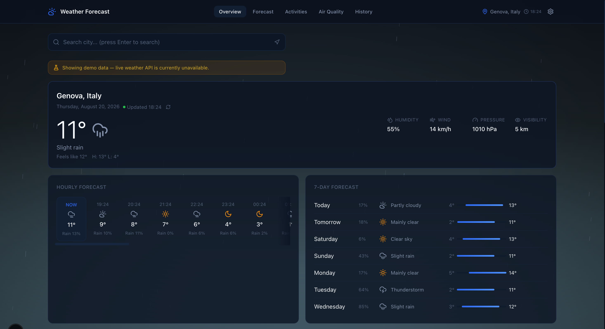
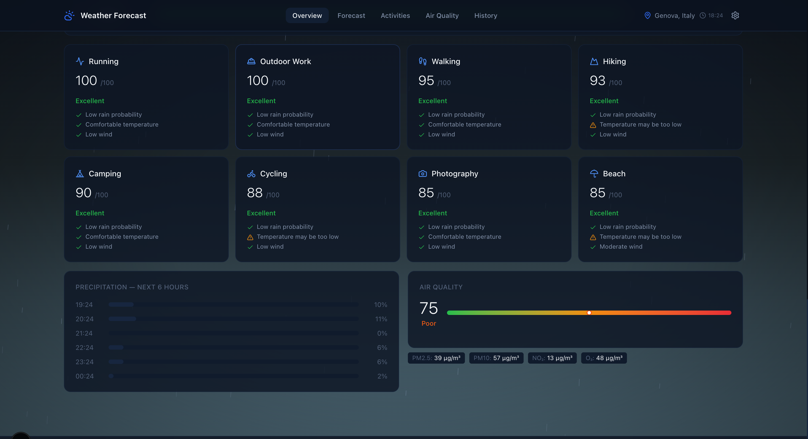
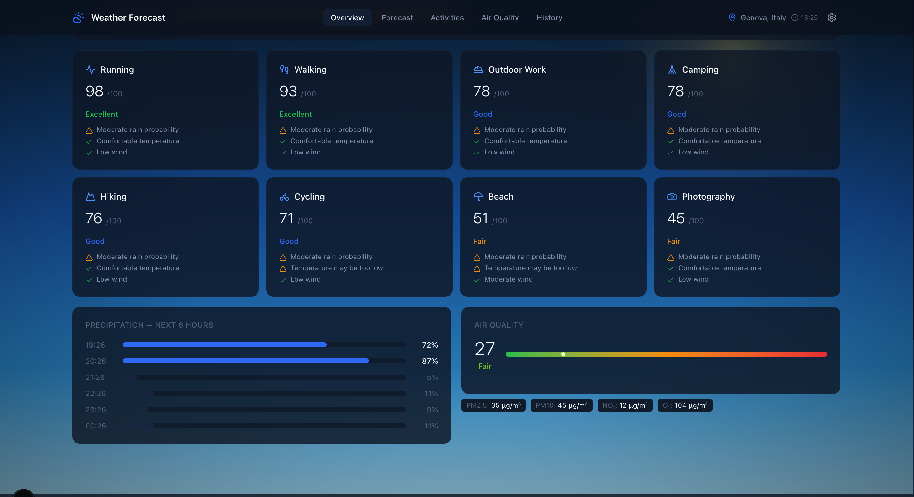
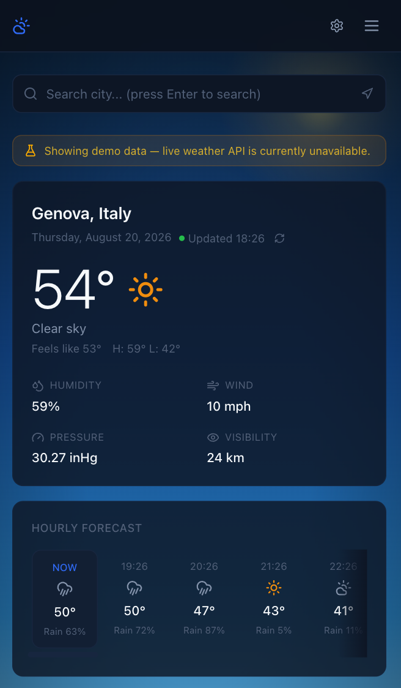
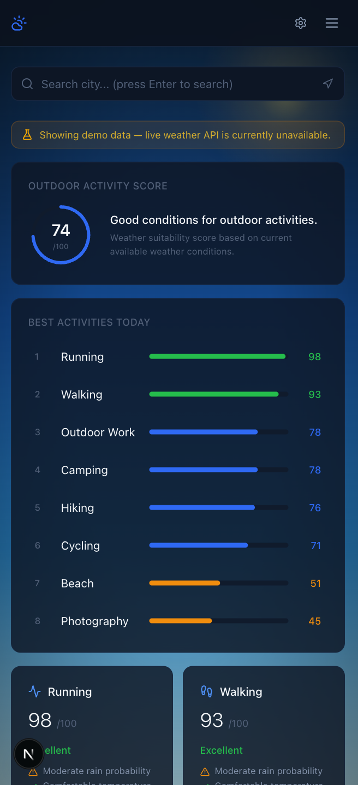

# Weather Forecast

A responsive weather dashboard built with Next.js and TypeScript using the OpenWeather API.

## Preview

Desktop





Mobile



## Features

### Current Weather

- Temperature and feels-like
- Humidity, wind speed and direction
- Atmospheric pressure
- Visibility distance
- Cloud cover percentage
- Sunrise and sunset times

### Forecast

- Hourly forecast (next 24 hours)
- 7-day daily forecast with high/low temperatures
- Precipitation probability bars

### Air Quality

- Air Quality Index (AQI)
- PM2.5 and PM10 concentrations
- NO2, O3, SO2, and CO levels
- Pollutant breakdown with level indicators

### Outdoor Activities

- Cycling, hiking, and running suitability scores
- Activity comparison cards
- Detailed scoring breakdown per activity
- Best time of day and conditions to avoid

### UI

- Dark theme with deep navy palette
- Animated weather backgrounds (rain, snow, fog, clear sky, thunderstorm)
- Day/night theme switching based on local sunrise/sunset
- Responsive layout for desktop, tablet, and mobile
- City search with OpenWeather geocoding
- Recent location history
- Skeleton loading states
- Error and rate-limit handling
- Mock data fallback when API is unavailable

## Tech Stack

| Technology | Purpose |
|---|---|
| [Next.js 16](https://nextjs.org/) | React framework with App Router |
| [TypeScript](https://www.typescriptlang.org/) | Type safety |
| [Tailwind CSS 4](https://tailwindcss.com/) | Utility-first styling |
| [Zustand](https://zustand.docs.pmnd.rs/) | Client state management |
| [Lucide React](https://lucide.dev/) | Icon library |
| [date-fns](https://date-fns.org/) | Date formatting |
| [OpenWeather API](https://openweathermap.org/api) | Weather, geocoding, and air quality data |

## Project Structure

```
src/
  app/
    api/
      weather/route.ts        # Weather data API proxy
      air-quality/route.ts    # Air quality API proxy
      geocode/route.ts        # City search API proxy
    globals.css               # Global styles, CSS variables, card classes
    layout.tsx                # Root layout with fonts and metadata
    page.tsx                  # Main page with view routing
  components/
    activities/
      ActivityScore.tsx       # Overall suitability score
      ActivityCards.tsx       # Per-activity score cards
      ActivityDetails.tsx     # Detailed scoring breakdown
      ActivityComparison.tsx  # Side-by-side activity comparison
    air-quality/
      AirQualityCard.tsx      # AQI display and pollutant grid
    common/
      EmptyState.tsx          # Placeholder for missing data
      ErrorState.tsx          # Error and rate-limit display
      SkeletonCard.tsx        # Loading skeleton components
      WeatherIcon.tsx         # WMO code to SVG icon mapping
    layout/
      Header.tsx              # Navigation, search, and settings
    location/
      LocationSearch.tsx      # City search with dropdown results
    weather/
      CurrentWeather.tsx      # Current conditions hero card
      DailyForecast.tsx       # 7-day forecast with temp bars
      HourlyForecast.tsx      # Scrollable hourly timeline
      PrecipitationChart.tsx  # Next 6h precipitation bars
      SunCard.tsx             # Sunrise/sunset arc
      UVIndex.tsx             # UV index gauge
      WeatherAlerts.tsx       # Weather warning banners
      WeatherBackground.tsx   # Canvas-based weather animations
      WindCard.tsx            # Wind compass with speed
  services/
    weatherApi.ts            # OpenWeather API client and data mapping
    mockWeatherData.ts        # Fallback data generator
  stores/
    weatherStore.ts          # Zustand store for app state
  types/
    weather.ts               # TypeScript type definitions
  utils/
    activityScore.ts         # Outdoor activity scoring logic
    unitConversion.ts        # Temperature, wind, and pressure converters
    weatherFormatters.ts     # Weather code descriptions and formatters
public/
  logo.svg
  robots.txt
```

## Installation

1. Clone the repository:

```bash
git clone https://github.com/your-username/weather-forecast.git
cd weather-forecast
```

2. Install dependencies:

```bash
npm install
```

3. Create a `.env` file from the example:

```bash
cp .env.example .env
```

4. Add your [OpenWeather API key](https://openweathermap.org/api) to `.env`:

```env
OPENWEATHER_API_KEY=your_key_here
```

5. Start the development server:

```bash
npm run dev
```

Open [http://localhost:3000](http://localhost:3000) in your browser.

## Build

```bash
npm run build
npm start
```

## APIs Used

### OpenWeather

All data comes from the [OpenWeather API](https://openweathermap.org/api). A free API key is required.

| Endpoint | Purpose |
|---|---|
| `/data/2.5/weather` | Current weather conditions |
| `/data/2.5/forecast` | 5-day forecast in 3-hour intervals |
| `/data/2.5/air_pollution` | Current air quality index and pollutant concentrations |
| `/geo/1.0/direct` | City name geocoding for search |

API calls are proxied through Next.js API routes (`/api/weather`, `/api/air-quality`, `/api/geocode`) to keep the key server-side.

## Responsive Design

The layout adapts to three breakpoints:

- **Desktop** (1024px+): Multi-column card grids, full navigation
- **Tablet** (768px–1023px): Two-column grids, condensed navigation
- **Mobile** (<768px): Single-column layout, collapsible hamburger menu

## Performance Notes

- API calls are aborted on subsequent requests to prevent race conditions
- Weather and air quality data are fetched in parallel
- 3-hour forecast intervals are aggregated into daily summaries on the client
- Search input is debounced at 300ms
- Weather background uses a single canvas element with requestAnimationFrame
- Unused dependencies are excluded from the bundle

## Future Improvements

- Add interactive weather map layer
- Support for saved favorite locations
- Hourly air quality breakdown
- Push notifications for severe weather alerts
- PWA support for offline access

## License

MIT
